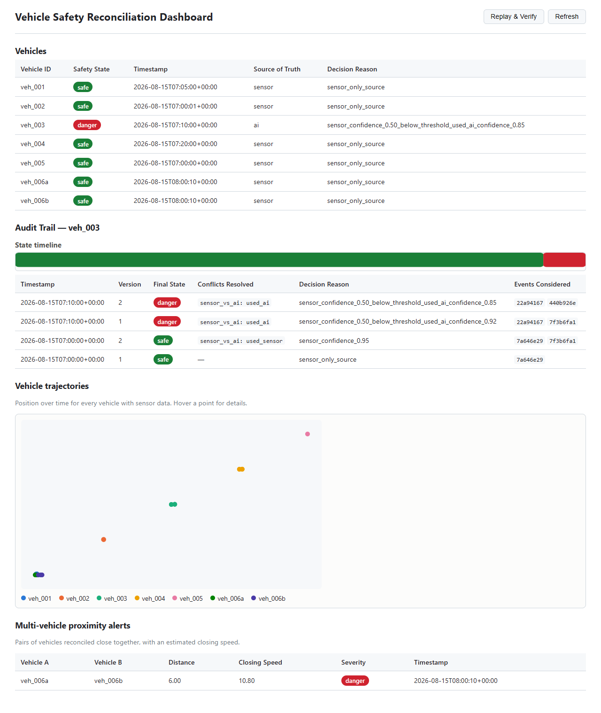

# Real-Time Multi-Source Vehicle Safety Event Reconciliation System

**Repository:** https://github.com/Abhinav1825/MyOnsite_Healthcare

A Flask + MongoDB backend (with a small vanilla JS/HTML/CSS dashboard) that ingests
asynchronous, possibly out-of-order safety events about vehicles from three sources —
**sensors** (V2V telemetry), **AI anomaly detection**, and **blockchain compliance logs** —
and reconciles them into one deterministic, auditable `safety_state` (`safe`/`alert`/`danger`)
per vehicle at each point in time. See [`prd.md`](prd.md) for the full spec.

## Architecture

```
POST /events → validate → events (immutable, deduped by event_id)
                              ↓
                 State Reconstruction (as-of lookups, interpolation,
                 sensor-conflict resolution)
                              ↓
                 Conflict Resolution (sensor vs AI, blockchain vs sensor)
                              ↓
        vehicle_states (versioned history)   audit_trail (decision log)
                              ↓                         ↓
                 Proximity check (bonus)      Dashboard (timeline, trajectories,
                              ↓                proximity, replay button)
                 proximity_alerts

POST /blockchain/submit (bonus) → same ingest+reconcile pipeline above,
                                   ALSO appends a hash-chained block to
                                   mock_blockchain (GET .../verify proves
                                   tamper-evidence)
```

**Key design decision:** `state(vehicle, T)` is always recomputed as a pure function of
`events(vehicle, timestamp ≤ T)`, never by "apply the newest event." This is what makes
late/out-of-order events, determinism, idempotency, and replay all fall out of the same
mechanism instead of needing separate special-case handling.

## Data-schema convention (resolves an ambiguity in the PRD)

The PRD leaves each source's `data` payload open-ended, but the reconciliation rules
("sensor vs AI disagree", "blockchain conflicts with sensor") require each event to carry
a comparable opinion. This implementation's convention:

- Every event's `data` MAY include a `status` field: `"safe" | "alert" | "danger"` — the
  source's own opinion of the vehicle's safety.
- If omitted, it's inferred:
  - **sensor** → `"safe"` (raw telemetry alone implies no verdict)
  - **ai** → derived from `data.alert`: no/`"none"` alert → `"safe"`; otherwise `"danger"`
    if `confidence ≥ 0.8` else `"alert"`
  - **blockchain** → derived from `data.compliance_status`: `"pass"` → `"safe"`,
    `"fail"` → `"alert"`
- `confidence` (0–1) comes from `data.confidence`, defaulting to `1.0` for sensor events
  and `0.5` for AI events if omitted. Blockchain logs are deterministic (pass/fail), not
  probabilistic.

**Resolution precedence** when multiple sources are present: sensor-vs-AI is resolved
first (interim decision); blockchain-vs-sensor is then checked — if blockchain conflicts
with the sensor reading and is newer, it overrides the interim decision outright;
otherwise the interim decision stands (and the audit trail still records that the
blockchain conflict was considered and rejected as stale).

## Project layout

```
app/
  config.py          tunable constants (0.8 confidence threshold, 10-min late window,
                      proximity distance/time-window/closing-speed thresholds, ...)
  db.py               MongoDB connection + collection accessors + indexes
  hashing.py           shared canonical-JSON + sha256 helpers (event IDs, blockchain hashes)
  models/             event validation, VehicleState value object
  routes/             POST /events, GET /vehicles(/<id>, /trajectories), GET /audit(/<id>),
                      POST /replay, GET /proximity, POST /blockchain/submit,
                      GET /blockchain/<id>(/verify)
  engine/
    ingestion.py       validate + dedupe + store raw events
    reconstruction.py  as-of lookups, sensor-conflict resolution, interpolation
    conflict.py        pure sensor-vs-AI / blockchain-vs-sensor rules
    reconciler.py       orchestrates the above, writes vehicle_states + audit_trail
    proximity.py        multi-vehicle proximity alerts (bonus scope)
    blockchain.py        mock hash-chained compliance ledger (bonus scope)
  replay.py            replay stored/re-posted events to verify consistency
static/                dashboard: vehicle table, state timeline, trajectory plot,
                       proximity panel, replay button (index.html, app.js, style.css)
fixtures/               6 edge-case datasets + load_fixtures.py + export_audit_output.py
tests/                  pytest suite (unit + integration, mongomock-backed)
```

## Getting started

```bash
git clone https://github.com/Abhinav1825/MyOnsite_Healthcare.git
cd MyOnsite_Healthcare
docker compose up -d --build
```

This starts MongoDB and the Flask app (http://localhost:5000). Open that URL for the
dashboard, or use the API directly - see the full endpoint list below.

### Loading the fixture datasets

```bash
python -m venv .venv && .venv/Scripts/pip install -r requirements.txt   # once
python fixtures/load_fixtures.py http://localhost:5000
```

This POSTs all 6 fixture files (`fixtures/*.json`) through the real API in order. Run it
a second time and every event should report as `DUPLICATE` with unchanged states — a
quick manual proof of idempotency.

### Reading audit output

- `GET /audit` — all decision-log entries (optionally `?vehicle_id=...`)
- `GET /audit/<vehicle_id>` — one vehicle's full decision history, newest first
- `POST /replay` — re-reconciles every stored (vehicle_id, timestamp) pair and reports
  whether anything unexpectedly changed (it shouldn't, if the system is deterministic)
- Mongo collection: `audit_trail` in the `vehicle_safety` database

## API reference (every endpoint, with a runnable example)

**Ingest an event:**
```bash
curl -X POST http://localhost:5000/events -H "Content-Type: application/json" -d '{
  "source":"sensor","vehicle_id":"veh_1","timestamp":"2026-08-15T07:00:00Z",
  "data":{"position":{"x":1,"y":2},"velocity":10,"confidence":0.9,"status":"safe"}}'
```

**Read vehicle state:**
```bash
curl http://localhost:5000/vehicles                    # current state, every vehicle
curl http://localhost:5000/vehicles/veh_1               # full history, one vehicle
curl http://localhost:5000/vehicles/trajectories        # position-over-time, every vehicle
```

**Read the audit trail:**
```bash
curl http://localhost:5000/audit                        # every decision, every vehicle
curl "http://localhost:5000/audit?vehicle_id=veh_1"      # filtered
curl http://localhost:5000/audit/veh_1                   # one vehicle, newest first
```

**Replay / consistency check:**
```bash
curl -X POST http://localhost:5000/replay
```

**Proximity alerts (bonus):**
```bash
curl http://localhost:5000/proximity                     # all alerts
curl "http://localhost:5000/proximity?vehicle_id=veh_1"  # filtered to one vehicle
```

**Mock blockchain ledger (bonus):**
```bash
curl -X POST http://localhost:5000/blockchain/submit -H "Content-Type: application/json" -d '{
  "vehicle_id":"veh_1","timestamp":"2026-08-15T07:00:00Z",
  "data":{"check_type":"emissions","compliance_status":"pass","certificate_id":"cert_001"}}'

curl http://localhost:5000/blockchain/veh_1               # full chain
curl http://localhost:5000/blockchain/veh_1/verify        # tamper-evidence check
```

To see `/verify` actually catch tampering, corrupt a stored block directly (simulating an
attacker bypassing the API) and re-check it - this is exactly what was done to validate the
feature during development:
```bash
docker compose exec mongo mongosh vehicle_safety --eval \
  "db.mock_blockchain.updateOne({vehicle_id:'veh_1', block_index:0}, {\$set: {'data.compliance_status': 'fail'}})"
curl http://localhost:5000/blockchain/veh_1/verify         # now valid:false
```

## Audit/decision-trace output files

`audit_output/` contains a static, committed snapshot of the audit trail and vehicle
states produced by loading the 6 fixtures (plus two demo blockchain submissions) — the
literal "audit/decision-trace output files" deliverable, so it can be inspected without
running the system:

- `current_vehicle_states.json` — latest state per vehicle
- `audit_trail_full.json` — every decision-log entry, all vehicles
- `proximity_alerts.json` — active multi-vehicle proximity alerts
- `blockchain_ledgers.json` — mock blockchain chain + verify result, per vehicle with one
- `<vehicle_id>.json` — one file per vehicle with its full state history + audit trail

Regenerate it any time with:
```bash
python fixtures/load_fixtures.py
python fixtures/export_audit_output.py
```

## Performance

The Docker image runs the app under **gunicorn** (4 workers × 4 threads), not Flask's
single-threaded dev server — that distinction matters for the NFR target below. Verified
with `scripts/load_test.py` (300 events, concurrency=40, vehicles spread across
well-separated position zones - see "A performance lesson" below) against the dockerized
stack. Reproduce it yourself:

```bash
.venv/Scripts/pip install -r requirements.txt   # once - needs `requests`
python scripts/load_test.py http://localhost:5000 300 40
```

| Metric | Target | Measured |
|---|---|---|
| Throughput | ≥100 events/sec | **~190 events/sec** |
| Latency (p95) | <500ms | **~270ms** |
| Success rate | — | 100% (300/300) |



## Bonus/advanced scope

All four items from the PRD's Advanced/Bonus Scope are implemented:

**1. Multi-vehicle proximity alerts** (`app/engine/proximity.py`, `GET /proximity`) — after
each reconciliation, the vehicle's position is compared against every other vehicle
reconciled within `PROXIMITY_TIME_WINDOW_SECONDS`. If within `PROXIMITY_DISTANCE_THRESHOLD`,
a `proximity_alerts` entry is written; severity escalates from `alert` to `danger` if the
two vehicles are also *closing* (approaching) faster than `PROXIMITY_CLOSING_SPEED_THRESHOLD`.
Velocity vectors aren't part of the event schema, so closing speed is estimated empirically
from each vehicle's own last two reconciled positions - no new input fields required.
Demonstrated by `fixtures/06_multi_vehicle_proximity.json` (two vehicles on a converging
path).

**2. Visualization dashboard** (`static/`) — beyond the vehicle table:
- a per-vehicle **state timeline** (colored SVG strip, safe/alert/danger over time) shown
  when you click a vehicle row
- a **2D trajectory plot** of every vehicle's position over time (`GET /vehicles/trajectories`)
- a **proximity alerts panel** listing active multi-vehicle alerts
- a **Replay & Verify** button that calls `POST /replay` and shows the consistency report

**3. Replay of historical events** — already core to the MVP (`POST /replay`,
`app/replay.py`); the dashboard button above is the bonus-scope UI entry point for it.

**4. Mock blockchain API** (`app/engine/blockchain.py`, `POST /blockchain/submit`,
`GET /blockchain/<vehicle_id>(/verify)`) — a real hash-chained ledger, not just another way
to post a `source=blockchain` event: each vehicle has its own chain of blocks, each hash
covering its own content *and* the previous block's hash, so `GET .../verify` can prove
tamper-evidence on demand (recomputes every hash and checks the chain linkage). Submitting
a block also feeds the normal reconciliation pipeline underneath, so the ledger and
`audit_trail` never disagree. Chain-level replay protection follows directly from the
same event-level idempotency the MVP already has: a duplicate submission appends no new
block.

### A performance lesson (kept here deliberately)

The first version of the proximity check computed each candidate pair's closing speed
(2 extra MongoDB round-trips) *before* checking whether the pair was even within the
distance threshold - an O(other vehicles) query blow-up per event. Under load with many
vehicles clustered close together, throughput dropped from ~190 to ~74 events/sec and p95
latency rose from ~270ms to over 1200ms, failing the NFR target. Fixed by (a) checking the
(free, in-memory) distance first and only querying for velocity vectors when a pair is
actually close, and (b) adding a `(superseded, timestamp)` index to support the
candidate-gathering query. Re-measured afterward at the numbers in the table above. Left
in here because "a bonus feature silently broke a verified NFR" is exactly the kind of
regression worth being explicit about having caught.

## Fixtures (edge cases)

| File | Scenario |
|---|---|
| `01_late_event.json` | A sensor reading arrives out of order, filling a gap between two existing readings; a later AI event has no exact sensor match and must be interpolated |
| `02_conflicting_sensor_updates.json` | Two sensor readings within 1s of each other; higher-confidence one is chosen deterministically |
| `03_sensor_vs_ai_conflict.json` | High-confidence sensor overrides AI; low-confidence sensor loses to AI |
| `04_blockchain_vs_sensor_conflict.json` | Newer blockchain log overrides a stale sensor reading; an even-newer sensor reading then overrides the now-stale blockchain log |
| `05_duplicate_replay.json` | The exact same event posted twice — must be detected as a duplicate, no new state version or audit entry |
| `06_multi_vehicle_proximity.json` | Two vehicles on a converging path end up within the proximity distance threshold while closing fast — produces a `danger`-severity proximity alert |

Fixtures 2–5 intentionally place their vehicles in well-separated position "zones"
(offsets of 1000+ units apart) so they don't spuriously trigger proximity alerts against
each other - they're unrelated demo scenarios, not vehicles that are meant to be near one
another. Only fixture 6 is a deliberate proximity scenario.

## Tests

```bash
.venv/Scripts/pip install -r requirements.txt
.venv/Scripts/pytest -q
```

77 tests covering: event validation, state reconstruction (as-of lookups, interpolation,
sensor-conflict resolution), all conflict-resolution rules (including confidence/timestamp
boundary cases), audit trail shape, replay/idempotency, proximity math (approaching vs
separating, distance-only vs distance+speed escalation), the blockchain ledger (chain
growth, duplicate-submission protection, tamper detection), and end-to-end API behavior
including all 6 fixtures. Tests run against an in-memory MongoDB (`mongomock`), no real
database required.

## Constraints honored

Python/Flask/JS/HTML/CSS/MongoDB/Git/Docker only; no Kafka/Redis/distributed
infrastructure; no ML/LLM components (the AI anomaly detector is treated as an external
black box whose already-computed alerts are consumed as input, never generated by this
system); blockchain compliance logs are simulated locally, not a real chain.
